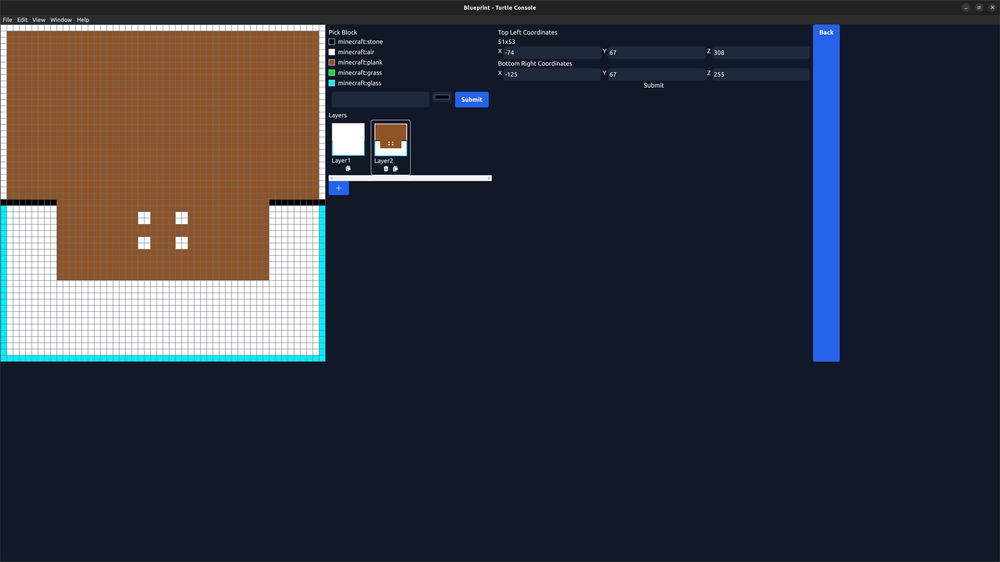

# Drone Turtles

## What is this?

This is an overly complicated program that allows you to control ComputerCraft turtles. The dashboard allows you to manually control the turtle, or draw blueprints for the turtle to build. This project is in very early development and is very buggy and will probably not be updated anytime soon.

## How does it work?

The turtles move via coordinates so you will need a [GPS cluster](https://www.computercraft.info/forums2/index.php?/topic/3088-how-to-guide-gps-global-position-system/) in your world. There are a couple of lua libraries that have to be installed on the turtle and running `drone` will connect the turtle to the WebSocket server. The WebSocket server is setup by the Electron dashboard and when a turtle connects, it should auto calibrate the turtle.

### Blueprint

Allows you to automate building things with turtles. You can add any block you want (even mod blocks). Blocks are saved between sessions, and the name should be based off the block's ID. The canvas is defined by the top left and bottom right coordinates of where the building should be built. Layers can be added to build up the Y axis.

When the submit button is pressed, the first connected turtle will be used to draw the building. If the turtle is missing a block that it needs to place, the turtle will wait and send out a request via rednet for more of said block.

There is a basic program, `item_fetcher`, to setup a turtle to grab items to refill empty turtles. At the moment, this program only works for one item per turtle and it tries to fill the empty turtle's inventory completely.